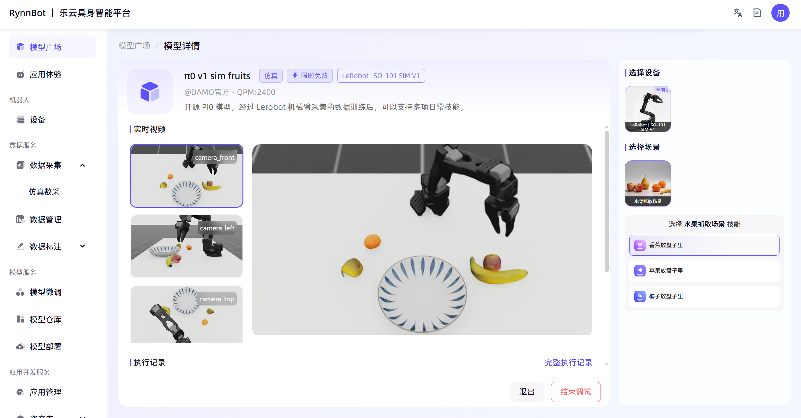
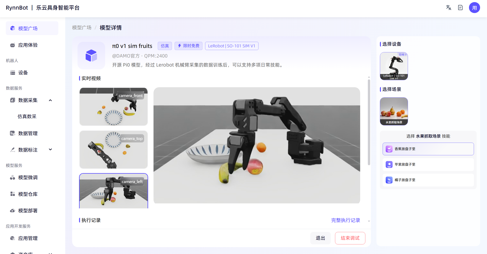
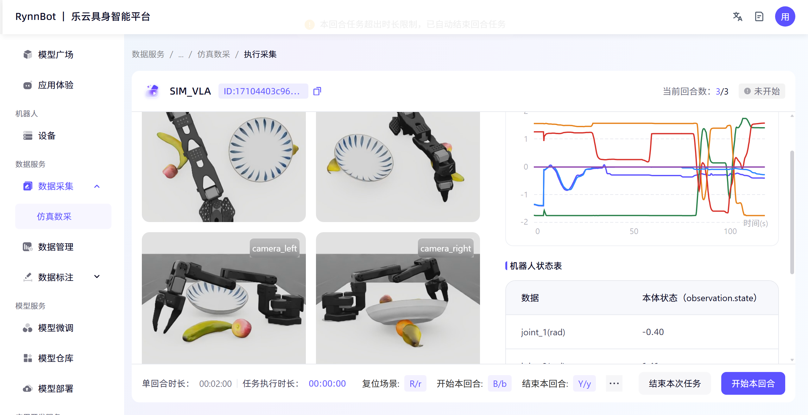

# VLA-Task3

先完成任务，思维链路：
我想，思维链路可以从硬件到模型到数据来讲吧，当然是个闭环。首先是要确定设备，硬件上的选择，接下来可以在模型广场上选择合适的模型（或者自己部署）进行技能检验和数据采集，数据采集之后用于标注之类的，接下来可以模型微调以实现特定的目标优化。这个也是闭环，数据用于优化模型微调，微调后产生新的数据。

在体验模型广场的那些机械臂之后，我说实话，我觉得，额，是不是模型太笨了。。抓个香蕉橘子需要那么久，效果也不好
belike: 

当然也不是都是失败的，我也多次训练下几乎成功实现了的样例
belike: 

当然也有成功的样例，我没有保存罢了。为了检验这个数据采集的难度，我亲自采集了下数据
belike: 
结果更是惨不忍睹

我其实有点认识到了，具身智能虽然是物理层面的智能，但是和我们常规的物体接触十分不同，机器难以控制力度，难以准确控制角度，（至少这个环境）缺少触觉力觉的反馈
真正的具身智能的落地，其实不只是模型的升级，我感觉其实与硬件和传感十分有关联

我们这个Task3的主题大概是了解具身智能的平台，体验数据相关的调试，这一点我觉得乐云具身智能这个平台做的还算是不错的，至少对于初学者，我们的上手难度还是非常小的，这种可视化的操作降低了门槛
就是大概是因为是新的平台吧，前端优化不太好，卡卡的
